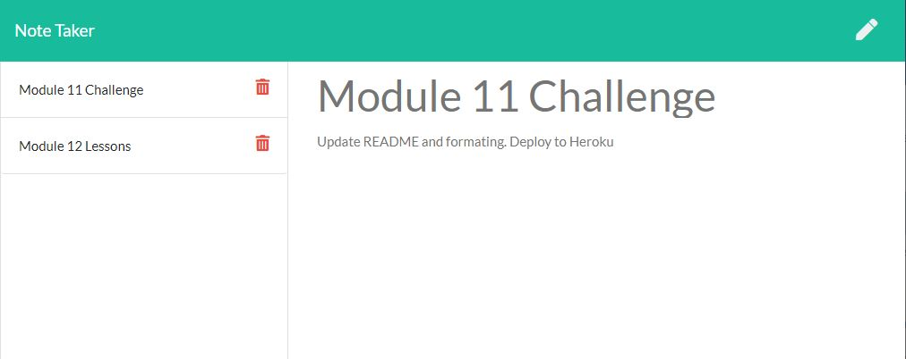

# Note Taker

## Purpose
To provide the user with an application to write and save notes to keep track of tasks needing to be completed.

## Features
When the user clicks the link on the landing page, they are presented with their previously logged notes listed on the left-hand side of a notes page. The user can add more notes by clicking on the pencil button at the top right-hand corner, and saving the addition; or they can delete old, unwanted notes by click on the specified note's trashcan. The details of the notes are displayed on the right-hand side of the page when clicking on the note itself.

## Built With
* HTML
* CSS
* JavaScript
* Node JS
* Express.js

## Heroku
https://note-taker-86753.herokuapp.com/

## Usage
To run program: nodemon server.js

## Project Status
Note Taker is compliant with defined acceptance criteria

## Contribution
Created by Jennifer Mulder
